# Nexus Alumni & Student Networking Platform

## Gamma AI Presentation Prompt

You are to generate a production-grade, investor/technical stakeholder presentation for the Nexus platform (KIIT University alumni & student networking), covering business vision, product features, technical architecture, data model, scalability, security, operations, roadmap, and strategic extensions. Use a clean modern theme with subtle academic branding. Prioritize clarity, layered storytelling, and progressive technical depth. Include speaker notes summarizing each slide succinctly. Use diagrams (Mermaid) exactly as provided or adapt them for visual consistency. Optimize for a 35–45 slide deck; group slides logically. Highlight differentiation, robustness, and future potential.

---
## Slide Group Outline (Adjusted: Introduction added, diagram per slide)

Each slide MUST include a Mermaid diagram. Use the provided diagram codes or create simplified variants. Mapping provided below.

### 1. Title & Opening  
Diagram: `D0_Title` (simple branding mindmap)
- Project name, tagline ("Connecting Students & Alumni for Lifelong Growth")
- Team / contributors
- Date & version

### 2. Introduction / Platform Snapshot  
Diagram: `A` System Context
- What Nexus is
- Audience & scope
- High-level capabilities
- Value proposition statement

### 3. Executive Summary  
Diagram: `D1_Exec` (value flowchart)
- Problem: fragmented alumni-student engagement
- Solution: unified networking & mentorship
- Early/planned traction placeholders
- Differentiators (messaging, mentorship, referrals, gamification)

### 4. Problem Space & Opportunity  
Diagram: `D2_Problems` (pain points cluster)
- Siloed communication & verification gaps
- Referral friction & mentorship scarcity
- Stakeholder pain points (student, alumni, admin)
- Expansion potential

### 5. Vision & Strategic Objectives  
Diagram: `D3_Vision` (goal timeline)
- Vision statement
- 12–24 month objectives
- Experience principles
- Strategic pillars

### 6. Personas & Core Use Cases  
Diagram: `D4_Personas` (roles to actions)
- Student: learn, connect, apply
- Alumni: mentor, refer, showcase
- Admin: moderate, verify, report
- Key use cases matrix

### 7. Feature Overview Map  
Diagram: `D5_FeatureMap` (cluster graph)
- Domains listing
- Maturity progression
- Core vs advanced scope
- Extensibility

### 8. High-Level System Overview  
Diagram: `A` System Context (reprise, simplified subset)
- Client + API + Gateway
- Real-time & push hybrid
- Persistence tiers
- Ext integration

### 9. Architecture Deep Dive  
Diagram: `B` Container / Deployment
- NestJS module layering
- Stateless token logic
- Redis adapter for scale
- Separation of concerns

### 10. Technology Stack Justification  
Diagram: `D6_TechStack` (layered stack chart)
- Backend choices rationale
- Real-time pattern
- Frontend UX stack
- Infra supportive components

### 11. Data Model Overview  
Diagram: `I` ER Core
- User-centric entities
- Interaction & engagement layers
- Moderation & security entities
- Growth extension points

### 12. Messaging Subsystem  
Diagram: `D` Sequence (offline scenario)
- Optimistic UI
- Multi-layer persistence
- Presence & read receipts
- Future encryption

### 13. Mentorship Domain  
Diagram: `G` Mentorship Lifecycle
- Listings & applications
- Acceptance flow
- Goals & meetings
- Progress tracking

### 14. Referral Workflow  
Diagram: `F` Referral Sequence
- Posting & verification
- Application lifecycle
- Status transitions
- Career impact

### 15. Gamification & Engagement Mechanics  
Diagram: `H` Points Award Sequence
- Event triggers
- Points + badges
- Endorsement loops
- Retention influence

### 16. Sub-Communities & Moderation  
Diagram: `K` Reporting Flow
- Creation requests
- Roles & permissions
- Flair & taxonomy
- Escalation pathway

### 17. Security & Compliance Layer  
Diagram: `D7_SecurityLayers` (defense-in-depth)
- Verification & documents
- Account states
- Audit & events
- OWASP controls

### 18. Performance & Scalability Strategy  
Diagram: `D8_Scale` (resource scaling flow)
- Redis horizontal scaling
- Index & query optimization
- Partition roadmap
- Caching strategies

### 19. Deployment & DevOps  
Diagram: `L` Deployment Infrastructure
- Containerization & proxy
- CI/CD pipeline
- Observability plan
- Migration & rollback

### 20. Reliability & Resilience  
Diagram: `D9_Reliability` (failover + fallback)
- Graceful degradation
- Retry patterns
- DR backups
- Resilience KPIs

### 21. Roadmap (Phased)  
Diagram: `D10_Roadmap` (timeline)
- Phase 1 core
- Phase 2 enrichment
- Phase 3 AI/analytics
- Phase 4 expansion

### 22. KPI & Metrics Framework  
Diagram: `D11_Metrics` (category mindmap)
- Engagement
- Conversion & career
- Retention
- Quality & moderation

### 23. Risks & Mitigations  
Diagram: `D12_Risks` (risk matrix chart)
- Adoption
- Data privacy
- Performance scale
- Operational burnout

### 24. Competitive Positioning  
Diagram: `D13_Competitive` (comparison grid)
- Specialized academic focus
- Trust & verification
- Integrated referrals & mentorship
- Extensible architecture

### 25. Future Extensions (Innovation)  
Diagram: `M` AI Recommendation Flow
- Mentor matching AI
- Skill graph inference
- Content recommendations
- Moderation intelligence

### 26. Financial / Resource Planning (Optional)  
Diagram: `D14_CostDrivers` (cost flow)
- Infra cost components
- Scaling thresholds
- Optimization levers
- Budget forecasting

### 27. Summary & Call to Action  
Diagram: `D15_Summary` (mission funnel)
- Mission recap
- Next milestone ask
- Resource focus
- Strategic emphasis

### 28. Appendix  
Diagram: `D16_Appendix` (index graph)
- Schema excerpts
- Additional flows
- Glossary & compliance
- Reference materials

### Slide-to-Diagram Mapping Table
| Slide | Diagram Code | Mermaid Type | Purpose |
|-------|--------------|--------------|---------|
| 1 | D0_Title | mindmap | Branding overview |
| 2 | A | flowchart | System snapshot |
| 3 | D1_Exec | flowchart | Value chain |
| 4 | D2_Problems | mindmap | Pain clusters |
| 5 | D3_Vision | timeline | Objectives |
| 6 | D4_Personas | flowchart | Roles & actions |
| 7 | D5_FeatureMap | mindmap | Domain clusters |
| 8 | A | flowchart | System context (simplified) |
| 9 | B | flowchart | Deployment/container |
| 10 | D6_TechStack | flowchart | Layered stack |
| 11 | I | erDiagram | Core model |
| 12 | D | sequence | Messaging flow |
| 13 | G | sequence | Mentorship lifecycle |
| 14 | F | sequence | Referral process |
| 15 | H | sequence | Points award |
| 16 | K | sequence | Moderation flow |
| 17 | D7_SecurityLayers | flowchart | Security strata |
| 18 | D8_Scale | flowchart | Scaling strategy |
| 19 | L | flowchart | Infra & deployment |
| 20 | D9_Reliability | flowchart | Resilience patterns |
| 21 | D10_Roadmap | timeline | Phased roadmap |
| 22 | D11_Metrics | mindmap | KPI categories |
| 23 | D12_Risks | flowchart | Risk matrix |
| 24 | D13_Competitive | flowchart | Competitive grid |
| 25 | M | flowchart | Future AI |
| 26 | D14_CostDrivers | flowchart | Cost breakdown |
| 27 | D15_Summary | flowchart | Mission funnel |
| 28 | D16_Appendix | flowchart | Reference index |

---
## Mermaid Diagrams Library
Use/render these diagrams across relevant slides. Each block is self-contained.

### A. System Context (C4 Simplified)
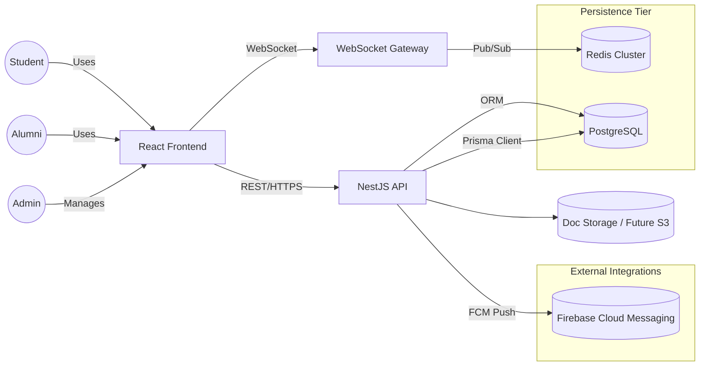

### B. Container / Deployment Diagram
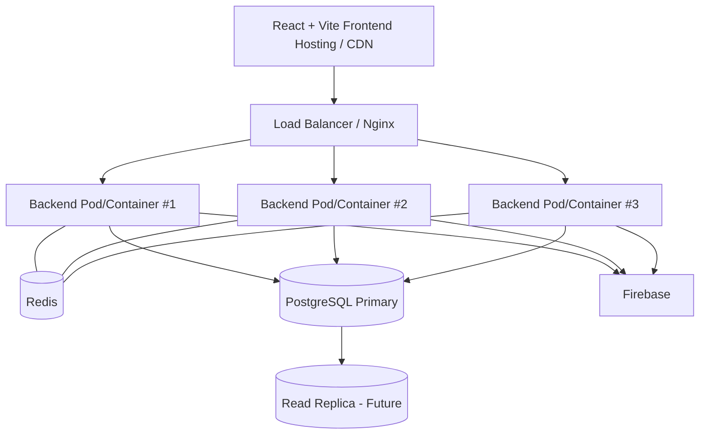

### C. Backend Module Dependency Graph
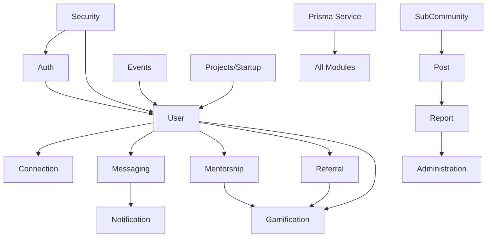

### D. Messaging Sequence (Offline Recipient Scenario)
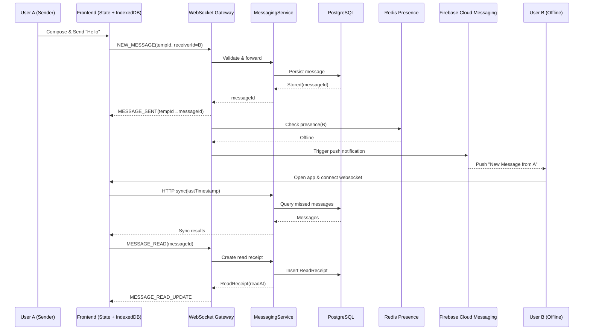

### E. Authentication Flow
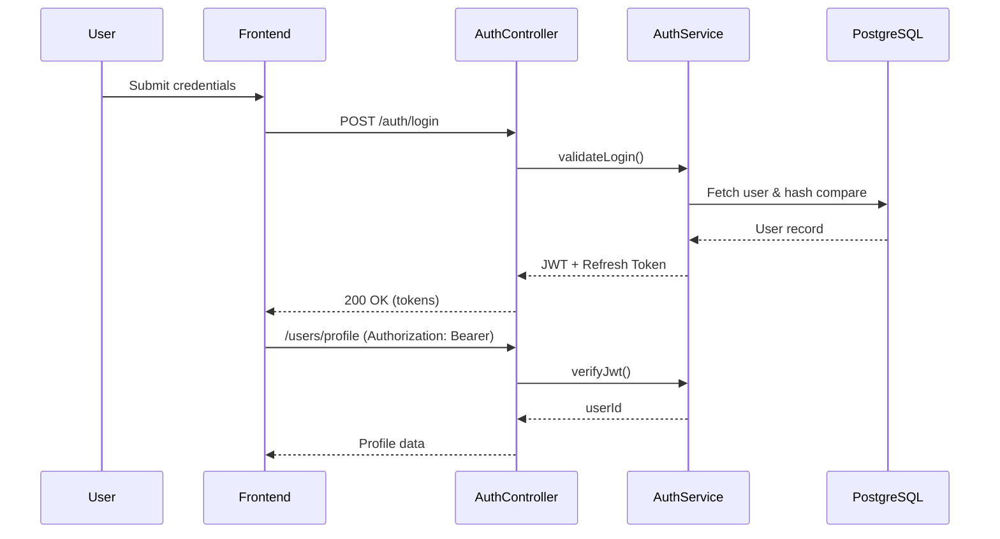

### F. Referral Application Workflow
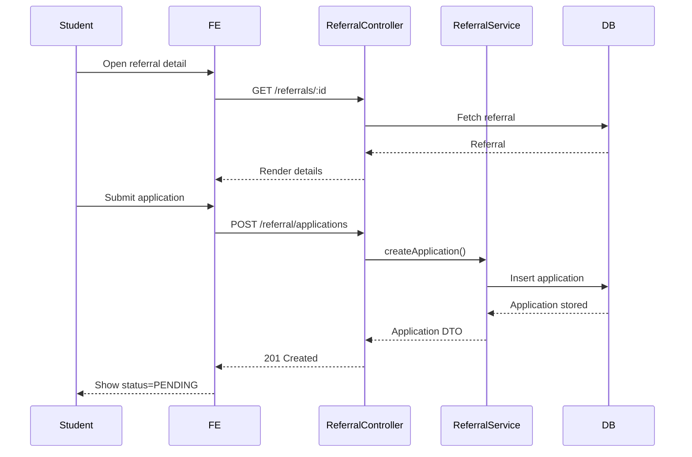

### G. Mentorship Lifecycle
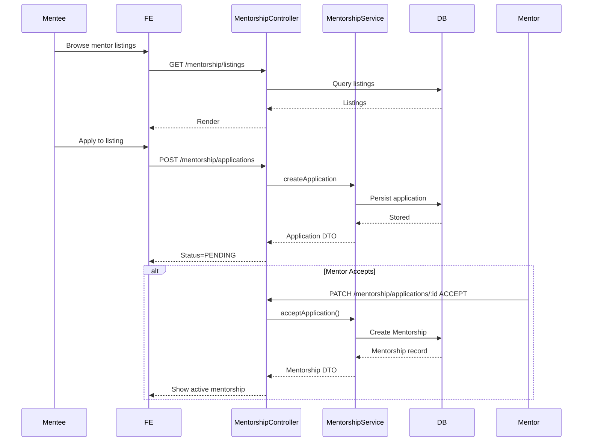

### H. Gamification Points Award
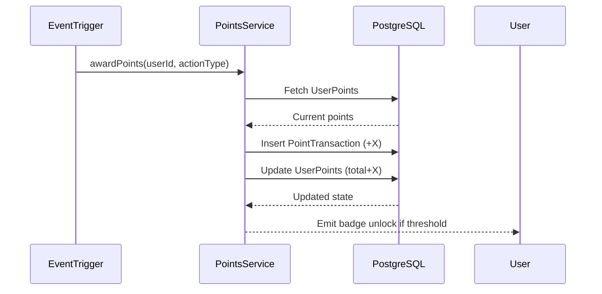

### I. Simplified ER Diagram (Core)
```mermaid
erDiagram
    USER ||--o{ CONNECTION : requester/recipient
    USER ||--o{ MESSAGE : sender
    USER ||--o{ MESSAGE : receiver
    MESSAGE ||--o{ READRECEIPT : has
    USER ||--o{ REFERRAL : posts
    REFERRAL ||--o{ REFERRALAPPLICATION : has
    USER ||--o{ REFERRALAPPLICATION : applies
    USER ||--o{ MENTORSHIP : mentor/mentee
    MENTORSHIP ||--o{ GOAL : tracks
    MENTORSHIP ||--o{ MEETING : schedules
    USER ||--o{ BADGE : earns (via UsersOnBadges)
    USER ||--o{ POST : authors
    POST ||--o{ COMMENT : has
    COMMENT ||--o{ COMMENT : replies
    POST ||--o{ CONTENTREPORT : reported
    COMMENT ||--o{ CONTENTREPORT : reported
    USER ||--o{ CONTENTREPORT : makes
    USER ||--o{ USERS_ON_BADGES : link
```

### J. Multi-Layer Message Persistence Flow
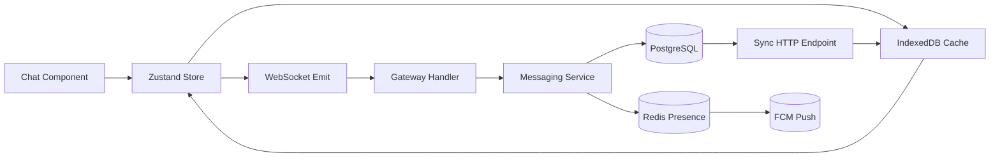

### K. Moderation & Reporting Flow
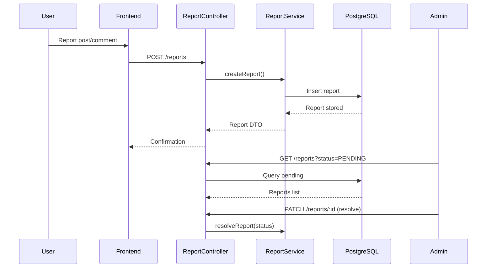

### L. Deployment / Infrastructure
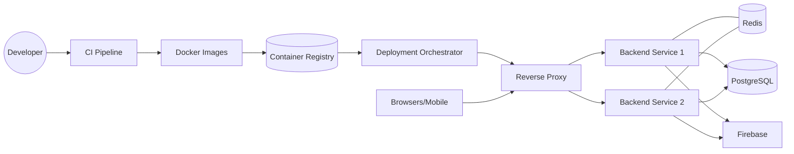

### M. Future AI Recommendation Flow (Conceptual)
### N. Title Slide Mindmap (D0_Title)
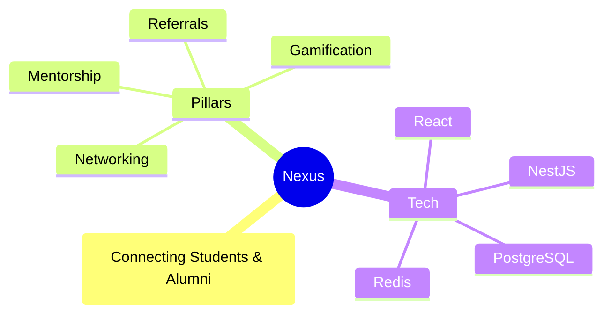

### O. Executive Value Flow (D1_Exec)
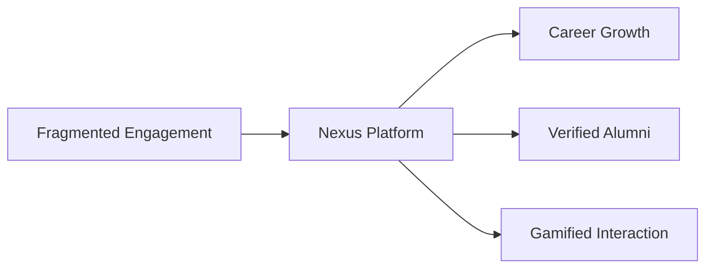

### P. Problem Clusters (D2_Problems)
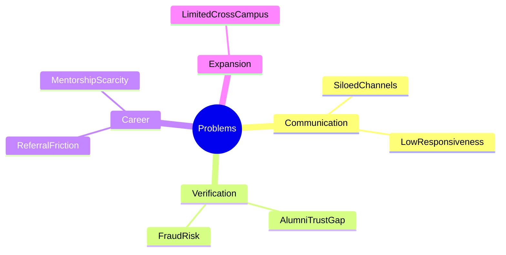

### Q. Vision Timeline (D3_Vision)
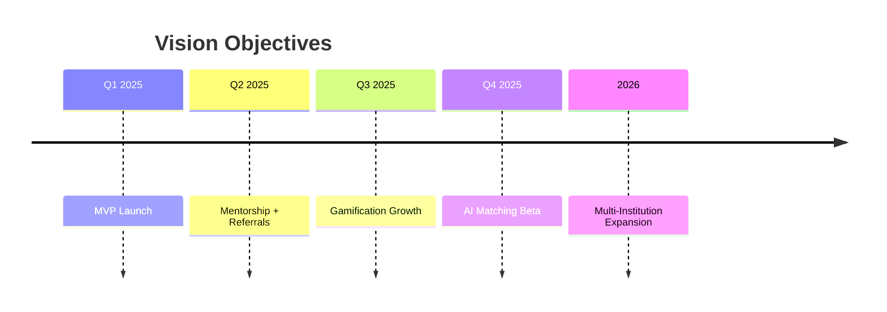

### R. Personas & Actions (D4_Personas)
```mermaid
flowchart LR
    Student --> UseCases[Apply Referral | Request Mentorship | Join Community]
    Alumni --> GiveBack[Post Referral | Mentor | Showcase]
    Admin --> Moderate[Verify Docs | Handle Reports | Manage Communities]
```

### S. Feature Map (D5_FeatureMap)
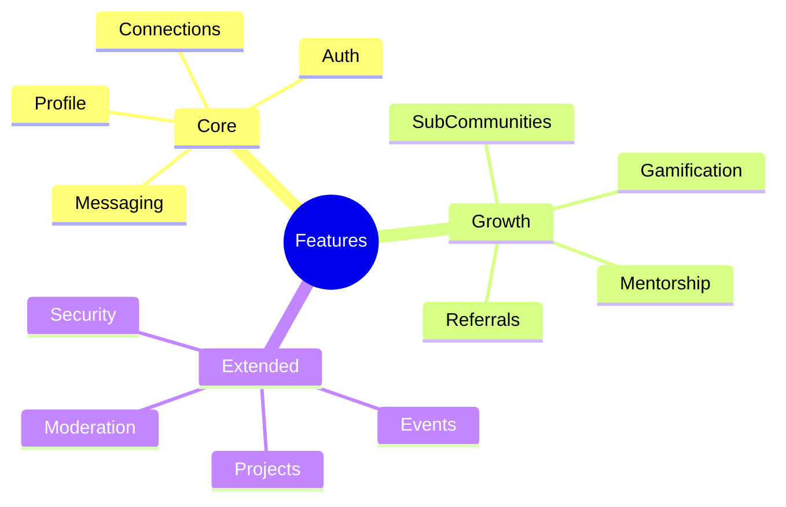

### T. Tech Stack Layers (D6_TechStack)
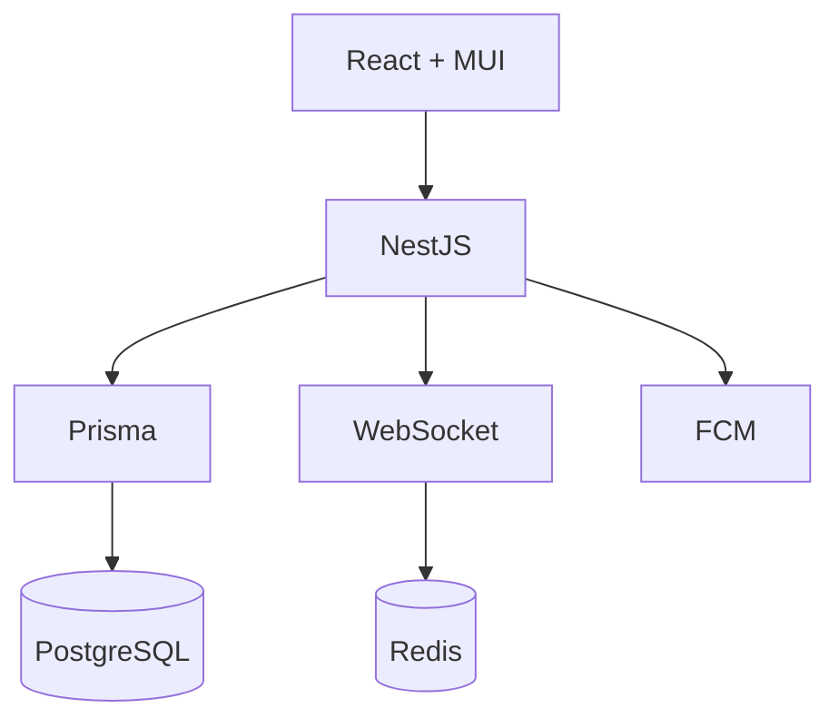

### U. Security Layers (D7_SecurityLayers)
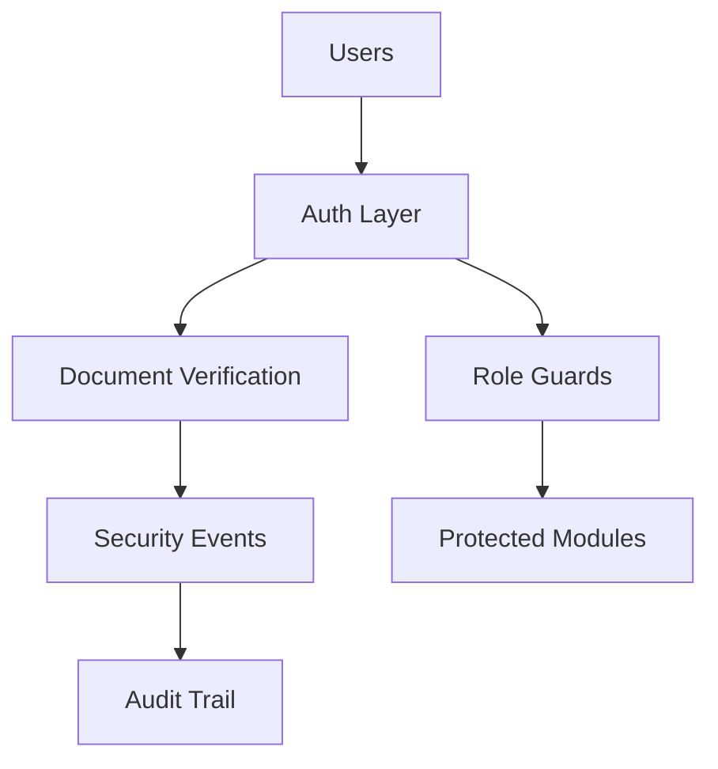

### V. Scaling Strategy (D8_Scale)
```mermaid
flowchart LR
    Clients --> LB[Load Balancer]
    LB --> Pods[Backend Pods]
    Pods --> Redis[(Redis Cluster)]
    Pods --> DB[(PostgreSQL)]
    Redis --> Presence[Presence / PubSub]
    DB --> Indexes[Index Optimization]
    DB --> Future[Partitioning Future]
```

### W. Reliability Patterns (D9_Reliability)
```mermaid
flowchart LR
    UserAction --> WS[WebSocket]
    WS --> Fallback[HTTP Sync]
    DB[(PostgreSQL)] --> Backup[Daily Backups]
    WS --> Retry[Retry Queue]
    Retry --> Delivery[Guaranteed Delivery]
```

### X. Roadmap Timeline (D10_Roadmap)
```mermaid
timeline
    title Roadmap
    Phase1 : Core Networking & Messaging
    Phase2 : Mentorship + Referrals + Gamification
    Phase3 : Analytics + AI
    Phase4 : Expansion + Mobile Apps
```

### Y. KPI Categories (D11_Metrics)
```mermaid
mindmap
    root((KPIs))
        Engagement
            DAU_MAU
            MessagesPerUser
        Conversion
            MentorshipAcceptance
            ReferralSuccess
        Retention
            WeeklyReturn
            BadgeVelocity
        Quality
            ModerationResolution
            VerificationTurnaround
```

### Z. Risk Matrix (D12_Risks)
```mermaid
flowchart TB
    Adoption[Adoption Risk] --> MitigationOnboard[Onboarding Campaigns]
    Privacy[Data Privacy Breach] --> MitigationAudit[Audits & Least Privilege]
    Performance[Performance Degradation] --> MitigationScale[Redis + Load Tests]
    Burnout[Mentor Burnout] --> MitigationBalance[Request Balancing]
    Fraud[Referral Fraud] --> MitigationVerify[Doc Verification]
```

### AA. Competitive Grid (D13_Competitive)
```mermaid
flowchart LR
    Generic[Generic Platforms] --> Gap[No Verification]
    Nexus[Nexus Platform] --> Trust[Verified Alumni]
    Nexus --> Integrated[Unified Mentorship & Referrals]
    Nexus --> Extensible[Modular Architecture]
```

### AB. Cost Drivers (D14_CostDrivers)
```mermaid
flowchart TB
    Users --> Compute[Compute]
    Compute --> RedisCost[Redis Cost]
    Compute --> DBCost[DB Storage]
    Users --> Bandwidth[Bandwidth]
    Features --> DevTime[Engineering Time]
```

### AC. Summary Funnel (D15_Summary)
```mermaid
flowchart LR
    Mission[Mission] --> Execution[Execution Pillars]
    Execution --> Outcomes[Career Outcomes]
    Outcomes --> Ask[Resource Ask]
```

### AD. Appendix Index (D16_Appendix)
```mermaid
flowchart LR
    Appendix --> Schema[Schema]
    Appendix --> Flows[Extra Flows]
    Appendix --> Glossary[Glossary]
    Appendix --> Compliance[Compliance]
```
```mermaid
flowchart TB
    Interactions[User Interactions] --> ETL[Event Stream]
    ETL --> Vectorize[Embedding Service]
    Vectorize --> Store[(Vector DB)]
    Store --> RecEngine[Recommendation Engine]
    RecEngine --> API[NestJS API]
    API --> UI[Personalized UI]
```

---
## Slide Content Guidance (Detailed Prompts)
Use the outline but generate each slide with:
1. Slide Title
2. Minimal headline / key takeaway
3. 3–5 bullet points max (clarity & impact)
4. Speaker Notes (expanded narrative, tie-ins to vision & metrics)
5. Where relevant, embed or reference Mermaid diagram snippet
6. For complex diagrams, optionally create a simplified version for presentation clarity
7. Use consistent iconography (Security, Performance, Growth, User, Data)

---
## Styling & Tone Directions
- Tone: Confident, informative, future-focused, academically credible
- Visual: High contrast, accessible typography, subtle motion
- Emphasize metrics placeholders (clearly marked as projected vs actual)
- Color coding for roles: Student (blue), Alumni (green), Admin (orange)
- Security & compliance callouts use shield icon; performance callouts use lightning icon

---
## Differentiators to Emphasize
- Structured mentorship lifecycle beyond generic chat
- Hybrid real-time + offline resilient messaging stack
- Integrated referral & career advancement workflows
- Gamified engagement with transparent event-driven point system
- Modular, testable backend enabling rapid feature evolution

---
## KPI & Analytics (Example Metrics Targets)
- Month 6: 40% DAU/MAU ratio
- Mentorship acceptance rate > 30%
- Referral approval cycle time < 5 days
- Average message latency < 120ms p95
- Badge acquisition retention lift: +15% week-over-week active return

---
## Risk Register (Sample)
| Risk | Category | Impact | Mitigation |
|------|----------|--------|------------|
| Low early adoption | Product | High | Targeted onboarding & campus ambassadors |
| Data privacy breach | Security | Critical | Regular audits, least privilege, logging |
| Performance degradation at scale | Tech | High | Load testing, Redis cluster, index strategy |
| Mentor burnout | Operational | Medium | Load balancing requests, recognition program |
| Referral fraud | Compliance | High | Document verification workflow, admin reviews |

---
## Roadmap Dependency Highlights
- Redis cluster prerequisite for cross-campus scaling
- Document verification automation before opening external referral APIs
- Vector DB integration dependent on stable interaction event schema

---
## Appendix Suggestions
- Extended schema sections
- Detailed moderation flow
- Infrastructure cost model
- Glossary (FCM, IndexedDB, Pub/Sub, SLO)
- Compliance checklist (GDPR-like handling, data retention policy)

---
## Instructions for Gamma AI
"""
Generate a 40-slide deck following the provided outline and diagrams. Each slide should:
- Maintain consistent brand styling
- Include speaker notes with narrative depth
- Reference mermaid diagrams where specified (render them if supported)
- Highlight strategic differentiators and upcoming AI expansion potential
- Populate metrics as placeholders where actual data not yet available
- End with an action-oriented summary (e.g., resources needed, next feature milestone)
"""

---
## Final Slide Call To Action
- Approve next phase (Mentorship + Referral enhancement)
- Allocate resources for Redis scaling & observability stack
- Greenlight initial AI recommendation prototype exploration

---
## Glossary (Quick)
- FCM: Firebase Cloud Messaging
- ORM: Object-Relational Mapping (Prisma)
- SLO: Service Level Objective
- Pub/Sub: Publish-Subscribe messaging pattern via Redis
- Optimistic UI: Immediate UI update before server confirmation

---
## Customization Notes
- Replace placeholders with real KPIs post initial deployment
- If mobile native apps prioritized, add dedicated architecture slide
- If multi-institution expansion imminent, add tenancy strategy slide

---
## End
This prompt file is exhaustive; prune sections if time-constrained.
